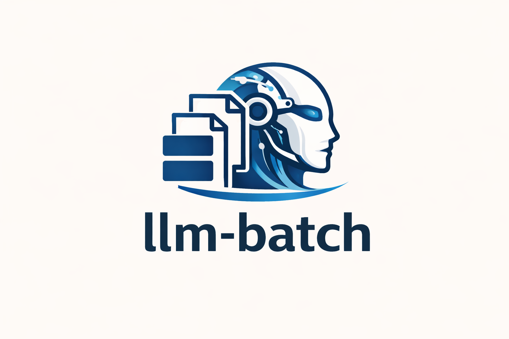

<p align="center">
  
</p>


<p align="center">
  A fast, memory-efficient CLI for <b>batch LLM inference</b><br/>
  with reusable prompt templates and resumable runs
</p>

<p align="center">
  <a href="https://github.com/wa3dbk/llm-batch/actions">
    
  </a>
  
  
  
</p>

<p align="center">
  <a href="#installation">Installation</a> •
  <a href="#quick-start">Quick start</a> •
  <a href="#command-line-options">CLI options</a> •
  <a href="#python-api">Python API</a>
</p>

### ⚡ One-liner example

```bash
llm-batch --model unsloth/Qwen2.5-7B-Instruct-bnb-4bit \
  --input data.tsv --template "Translate to English: {source}" --output out.tsv --batch-size 8
```
where `{source}` is the column name in data.tsv containing the text to translate.


## ✨ Features

- 🚀 **Memory-efficient** — Unsloth or 4-bit quantization for low VRAM usage
- 📦 **Batch processing** — Process TSV, CSV, JSONL, or plain text files
- 📝 **Prompt templates** — Use placeholders like `{column_name}` in prompts
- 🔁 **Resumable runs** — Checkpoints store full config so interrupted jobs can be resumed with a single flag
- ⚙️ **Config-driven** — Load settings from YAML or JSON and override with CLI flags
- 🧩 **Extensible** — Modular design for easy customization

 
## 📦 Installation

```bash
# Create new environment
conda create -n llmbatch_env python=3.11 -y
conda activate llmbatch_env

# Clone the llm_batch repository
git clone https://github.com/wa3dbk/llm-batch.git

cd llm-batch

# Install in development mode
pip install -e .

# Or install with dev/test dependencies
pip install -e ".[dev]"

# Optional: Install Unsloth for 2x faster inference
pip install "unsloth[colab-new] @ git+https://github.com/unslothai/unsloth.git"

# Or the stable version
pip install unsloth
```

## 🚀 Quick Start

### Basic Translation with batching

```bash
llm-batch \
    --model unsloth/Qwen2.5-7B-Instruct-bnb-4bit \
    --input sentences.tsv \
    --template "Translate to English: {source}" \
    --output translations.tsv \
    --batch-size 8 \
    --num-beams 4
```

### Using Template Files

```bash
llm-batch \
    --model unsloth/Qwen2.5-7B-Instruct-bnb-4bit \
    --input data.tsv \
    --template templates/nmt_arabic_english.md \
    --system-prompt templates/system_translator.txt \
    --batch-size 8 \
    --output results.jsonl
```

### Summarization

```bash
llm-batch \
    --model unsloth/Qwen2.5-7B-Instruct-bnb-4bit \
    --input articles.jsonl \
    --template "Summarize in 3 sentences:\n\n{text}\n\nSummary:" \
    --output summaries.tsv \
    --max-tokens 256 \
    --temperature 0.3
```

### Using a Config File

Save settings in a YAML or JSON file and optionally override individual options on the command line:

```yaml
# config.yaml
model: unsloth/Qwen2.5-7B-Instruct-bnb-4bit
input_file: data.tsv
template: "Translate to English: {source}"
output_file: results.tsv
batch_size: 8
num_beams: 4
```

```bash
llm-batch --config config.yaml

# Override specific values
llm-batch --config config.yaml --batch-size 16 --output other.tsv
```

## 📁 Input Formats

### TSV/CSV

Tab or comma-separated files with headers:

```
source	target
مرحبا	Hello
كيفاش حالك	How are you
```

### JSONL

JSON Lines format:

```json
{"source": "مرحبا", "id": 1}
{"source": "كيفاش حالك", "id": 2}
```

### Plain Text

One item per line:

```
مرحبا
كيفاش حالك
```

## 📐 Prompt Templates

Templates support `{placeholder}` syntax where placeholders are replaced with values from your input data.

### Inline Template

```bash
--template "Translate to English: {source}"
```

### Template File (Markdown)

Create `templates/my_template.md`:

```markdown
# Translation Task

Translate the following Arabic text to English.

## Arabic:
{source}

## English:
```

Then use it:

```bash
--template templates/my_template.md
```

### With System Prompt

```bash
--template "Translate: {source}" \
--system-prompt "You are a professional translator."
```

### Built-in NMT Templates

Several built-in templates are available by name, based on prompts from [Jon et al. (AbjadNLP 2026)](https://aclanthology.org/2026.abjadnlp-1.41/) that are designed to produce clean translation output without extra verbosity:

| Name | Direction | Placeholders |
|------|-----------|--------------|
| `nmt` | Dialect-specific | `{target_language}`, `{source}` |
| `nmt_general` | English to Arabic | `{source}` |
| `nmt_ar2en` | Arabic to English | `{source}` |

```bash
# Arabic to English using built-in template
llm-batch -m Jais-2-70B-Chat \
  --template nmt_ar2en -i test.tsv -o out.tsv \
  --no-sample --num-beams 4 --max-length-ratio 5

# Dialect-specific (test.tsv needs target_language and source columns)
llm-batch -m Jais-2-70B-Chat \
  --template nmt -i test.tsv -o out.tsv \
  --no-sample --num-beams 4 --max-length-ratio 5
```

All NMT templates include a system prompt that instructs the model to output only the translation. You can also use the template files directly:

```bash
--template templates/nmt_ar2en.md \
--system-prompt templates/system_nmt.txt
```

## 🧰 Command-Line Options

### Model Options

| Option | Description | Default |
|--------|-------------|---------|
| `--model, -m` | Model name or path | Required |
| `--quantization, -q` | Quantization level (4bit, 8bit, 16bit, none) | 4bit |
| `--backend` | Backend (unsloth, transformers, auto) | auto |
| `--dtype` | Data type (float16, bfloat16, float32) | float16 |
| `--max-seq-len` | Maximum sequence length | 4096 |

### Input/Output Options

| Option | Description | Default |
|--------|-------------|---------|
| `--input, -i` | Input file path | Required |
| `--output, -o` | Output file path | Required |
| `--input-cols` | Column names (comma-separated) | Auto-detect |
| `--delimiter` | Delimiter for TSV/CSV | Tab |

### Template Options

| Option | Description | Default |
|--------|-------------|---------|
| `--template, -t` | Prompt template (string or file path) | Required |
| `--system-prompt, -s` | System prompt (string or file path) | None |
| `--no-chat-template` | Disable chat template formatting | False |

### Generation Options

| Option | Description | Default |
|--------|-------------|---------|
| `--max-tokens` | Maximum new tokens to generate | 256 |
| `--temperature` | Sampling temperature | 0.7 |
| `--top-p` | Top-p (nucleus) sampling | 0.9 |
| `--top-k` | Top-k sampling | 50 |
| `--num-beams` | Beam search beams (1 = no beam search) | 1 |
| `--repetition-penalty` | Repetition penalty | 1.1 |
| `--no-repeat-ngram` | No repeat n-gram size | 0 |
| `--no-sample` | Use greedy decoding | False |

### Processing Options

| Option | Description | Default |
|--------|-------------|---------|
| `--batch-size` | Batch size for inference | 1 |
| `--limit, -n` | Limit number of samples | None |
| `--skip` | Skip first N samples | 0 |
| `--checkpoint-every` | Save checkpoint every N items | 100 |
| `--resume` | Resume from checkpoint file | None |

### Output Processing

| Option | Description | Default |
|--------|-------------|---------|
| `--strip-output` | Strip whitespace from output | True |
| `--extract-pattern` | Regex pattern to extract from output | None |
| `--max-length-ratio` | Crop output exceeding this ratio vs source length (e.g. 5.0) | None |
| `--stop-strings` | Comma-separated stop strings | None |
| `--include-input` | Include input columns in output | False |
| `--include-prompt` | Include full prompt in output | False |

### Miscellaneous

| Option | Description | Default |
|--------|-------------|---------|
| `--config` | Load config from YAML/JSON file | None |
| `--list-models` | List recommended models | - |
| `--dry-run` | Show what would be processed | False |
| `--verbose, -v` | Increase verbosity (-v, -vv) | 0 |
| `--quiet` | Suppress progress output | False |
| `--seed` | Random seed | 42 |
| `--device` | Device (auto, cuda, cpu, cuda:0, ...) | auto |

## 🤖 Recommended Models

### NMT / Arabic Dialects

Based on [Jon et al. (AbjadNLP 2026)](https://aclanthology.org/2026.abjadnlp-1.41/) evaluation of 16 LLMs on dialectal Arabic MT:

| Model | Size | Notes |
|-------|------|-------|
| `Jais-2-70B-Chat` | 70B | Best open-source for dialectal Arabic MT |
| `Jais-2-8B-Chat` | 8B | Good Arabic, lower VRAM |
| `Nile-Chat-12B` | 12B | Egyptian dialect specialist |
| `c4ai-command-r7b-arabic-02-2025` | 7B | Arabic-tuned Command-R |
| `aya-expanse-32b` | 32B | Strong multilingual MT |
| `aya-expanse-8b` | 8B | Lighter Aya variant |
| `c4ai-command-r-08-2024` | 32B | Multilingual, good MT scores |
| `command-a-translate-08-2025` | 111B | Highest quality if VRAM allows |
| `gemma-3-27b-it` | 27B | Strong multilingual |
| `Qwen3-4B-Instruct-2507` | 4B | Fast, decent quality |

### Best for Arabic/Multilingual

| Model | VRAM | Notes |
|-------|------|-------|
| `unsloth/Qwen2.5-7B-Instruct-bnb-4bit` | ~8GB | Excellent multilingual |
| `unsloth/Qwen2.5-3B-Instruct-bnb-4bit` | ~5GB | Good balance |
| `CohereForAI/aya-23-8B` | ~10GB | Great for translation |
| `inceptionai/jais-family-6p7b-chat` | ~8GB | Best Arabic tokenizer |

### Fast & Efficient

| Model | VRAM | Notes |
|-------|------|-------|
| `unsloth/Qwen2.5-1.5B-Instruct-bnb-4bit` | ~3GB | Fast, decent quality |
| `unsloth/Llama-3.2-1B-Instruct-bnb-4bit` | ~3GB | Very fast |
| `unsloth/gemma-3-4b-it-unsloth-bnb-4bit` | ~4GB | Good quality |

### High Quality

| Model | VRAM | Notes |
|-------|------|-------|
| `unsloth/Meta-Llama-3.1-8B-Instruct-bnb-4bit` | ~10GB | Strong general |
| `Llama-3.3-70B-Instruct` | 70B | Strong general + Arabic |
| `Mistral-Small-3.2-24B-Instruct-2506` | 24B | High quality |
| `EuroLLM-9B-Instruct` | 9B | European + Arabic |

## 📘 Examples

### NMT Evaluation

```bash
# Prepare test data (test.tsv with 'source' and 'reference' columns)

# Run inference using the built-in NMT template
llm-batch \
    --model unsloth/Qwen2.5-7B-Instruct-bnb-4bit \
    --input test.tsv \
    --template nmt_ar2en \
    --output predictions.tsv \
    --no-sample \
    --num-beams 4 \
    --max-tokens 256 \
    --max-length-ratio 5

# Evaluate with sacrebleu
cut -f2 predictions.tsv | sacrebleu test.reference.txt
```

### Batch Summarization

```bash
llm-batch \
    --model unsloth/Qwen2.5-7B-Instruct-bnb-4bit \
    --input articles.jsonl \
    --template templates/summarization.md \
    --output summaries.jsonl \
    --max-tokens 512 \
    --temperature 0.3 \
    --include-input
```

### Resume Interrupted Job

Checkpoints are saved automatically every `--checkpoint-every` items (default 100). Each checkpoint stores the full run configuration, so resuming requires only the checkpoint path:

```bash
# If job was interrupted, resume from checkpoint
llm-batch --resume results.jsonl.checkpoint
```

### Extract Specific Output

```bash
# Extract only the translation from verbose output
llm-batch \
    --model unsloth/Qwen2.5-7B-Instruct-bnb-4bit \
    --input data.tsv \
    --template "Translate: {source}\nTranslation:" \
    --output results.tsv \
    --extract-pattern "Translation:\s*(.*)"
```

### Crop Degenerate Output

Some LLMs produce repetitive or overly long output. Use `--max-length-ratio` to
automatically crop output that exceeds a multiple of the source input length:

```bash
# Crop output longer than 5x the source text
llm-batch \
    --model unsloth/Qwen2.5-7B-Instruct-bnb-4bit \
    --input data.tsv \
    --template nmt_ar2en \
    --output results.tsv \
    --max-length-ratio 5
```

## 🐍 Python API

```python
from llm_batch import InferenceEngine, InferenceConfig

# Create config
config = InferenceConfig(
    model="unsloth/Qwen2.5-7B-Instruct-bnb-4bit",
    input_file="data.tsv",
    template="Translate to English: {source}",
    output_file="results.tsv",
    max_new_tokens=256,
    num_beams=4,
)

# Run inference
engine = InferenceEngine(config)
engine.run()
```

Or use the convenience function:

```python
from llm_batch import run_inference

run_inference(
    model="unsloth/Qwen2.5-7B-Instruct-bnb-4bit",
    input_file="data.tsv",
    template="Translate to English: {source}",
    output_file="results.tsv",
)
```

## 🏗️ Architecture

```
llm_batch/
├── __init__.py      # Package exports
├── cli.py           # Command-line interface
├── config.py        # Configuration management
├── model_loader.py  # Model loading (Unsloth/HF)
├── data_loader.py   # Data loading (TSV/CSV/JSONL/TXT)
├── template.py      # Prompt template handling + built-in NMT templates
├── output.py        # Output writing, processing, and length-ratio guard
├── engine.py        # Main inference engine
└── utils.py         # Shared utilities

templates/
├── system_nmt.txt          # NMT system prompt (Jon et al., 2026)
├── nmt_dialect.md          # Dialect-specific translation template
├── nmt_en2ar.md            # English to Arabic template
├── nmt_ar2en.md            # Arabic to English template
├── nmt_arabic_english.md   # Tunisian Arabic to English template
├── system_translator.txt   # General translator system prompt
└── summarization.md        # Summarization template
```

## ✅ Testing

```bash
pip install -e ".[dev]"
pytest
```

## 🚑 Troubleshooting

### Out of Memory

- Use `--quantization 4bit` (default)
- Reduce `--max-seq-len`
- Use a smaller model

### Slow Inference

- Install Unsloth: `pip install unsloth`
- Use `--num-beams 1` (disable beam search)
- Increase `--batch-size` (if VRAM allows)
- Install Flash Attention 2 (`pip install flash-attn`) for automatic speedup when using the transformers backend

### Repetitive Output

- Increase `--repetition-penalty` (e.g., 1.2)
- Add `--no-repeat-ngram 3`
- Lower `--temperature`

### Beam Search with Unsloth

Unsloth's patched KV cache does not support beam search (`'tuple' object has no
attribute 'reorder_cache'`). The tool automatically falls back to greedy
decoding and logs a warning. If you need beam search, force the transformers
backend:

```bash
llm-batch --backend transformers --num-beams 4 ...
```

### Import Errors

```bash
# If Unsloth has issues, force transformers backend
llm-batch --backend transformers ...
```

## ⚖️  License

MIT License
